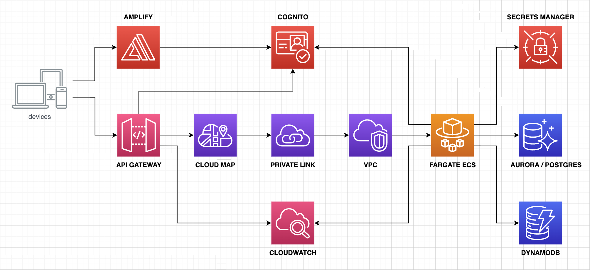

# Timer Service: A Quartz microservice that run Cron Jobs on AWS Fargate ECS.
- **Author**: [Andres Solorzano](https://www.linkedin.com/in/aosolorzano/).
- **Level**: Advanced.
- **Technologies**: Ionic, Angular, Java, GraalVM, Quarkus, Quartz, PostgreSQL, Docker, AWS SDK, Amplify, DynamoDB, API Gateway, Copilot and CloudFormation.

## Description
This project uses the Quarkus Framework to perform CRUD operations over Tasks records stored on an AWS DynamoDB table.
This Tasks also realises CRUD operations against Quartz Cron Jobs stored on AWS Aurora Postgres DB to maintain state among Jobs in a clustered environmend.

The following image shows the overall architecture of the application on AWS.


If you want to learn more about Quarkus, please visit its website: https://quarkus.io/.

### Tutorial details on Medium.com
You can follow a detailed tutorial with the last changes of the Timer Service application on my [Medium blog](https://aosolorzano.medium.com/jwt-verification-against-amazon-cognito-using-java-quarkus-55f3d22456ae).

## Requirements
1. An AWS account.
2. [Git](https://git-scm.com/downloads).
3. [AWS CLI](https://docs.aws.amazon.com/cli/latest/userguide/getting-started-install.html).
4. [Amplify CLI](https://docs.amplify.aws/cli/start/install).
5. [AWS Copilot CLI](https://aws.github.io/copilot-cli/).
6. [GraalVM](https://www.graalvm.org/downloads/) with OpenJDK 17. You can use [SDKMAN](https://sdkman.io/install).
7. [Maven](https://maven.apache.org/download.cgi).
8. [Docker](https://www.docker.com/products/docker-desktop/) and [Docker Compose](https://github.com/docker/compose).

## Deploying Timer Service to AWS
Execute the following script located at project's root folder:
```
run-scripts.sh
```
This script will show you an option's menu where you can select various steps to deploy the Timer Service on AWS.

## FRONTEND
### Deploying Timer Service Locally
First, you must configure Amplify into the Ionic project:
```
amplify init
```
Then, you must configure the authentication provider with the following command:
```
amplify add auth
```
The following image shows you some configuration properties that I used to configure Cognito:


Then, install Amplify dependencies:
```
npm install aws-amplify @aws-amplify/ui-angular
```

### Updating Angular dependencies
Verify the angular versions that can be updated inside the project:
```
ng edit
```
Try to edit the corresponding packages showed in the last command output. For example:
```
ng edit @angular/cli @angular/core --allow-dirty --force
```
And those Angular dependencies will be updated.

## Angular Reactive (NgRx) dependencies
For NgRx, we need to install the following dependencies:
```
ng add @ngrx/data
ng add @ngrx/store
ng add @ngrx/effects
ng add @ngrx/router-store
ng add @ngrx/store-devtools
```
These commands edit the "app.module.ts" file with the required imports and initial configurations. See the blog article fo more details.

## Ionic Commands and Configurations
To create a new ionic project using a blank template;
```
ionic start <project-name> blank --type=angular
```
To create a new angular **module** with a routing file;
```
ionic g module shared/components --routing
```
To create a new **component** (not include a module and routing file):
```
ionic g component shared/components/header --spec=false
```
To create a new **page** component without the spec file:
```
ionic g page shared/pages/home --spec=false
```
If you want to only visualize the files that will be created, add the dry-run directive:
```
ionic g page shared/pages/home --spec=false --dry-run
```
To create a new angular **service** without the test file, you can execute the following:
```
ionic g service shared/services/storage --skipTests
```

### Animate CSS
[Animate.css](https://animate.style/) is a library of ready-to-use, cross-browser animations for use in your web projects.
```
npm install animate.css --save
```
Modify the "global.scss" file to add the following code:
```
@import "~animate.css/animate.min.css";
```

### Ionic DateTime
For this component, we must install the "date-fns" and "date-fn-tz" dependency for datetime validation and manipulation:
```
npm install date-fns --save
npm install date-fns-tz --save
```

## BACKEND
### Running the Timer Service using Docker Compose
Build the Timer Service container image:
```
docker-compose -f utils/docker/docker-compose.yml build
```
Deploy the local cluster of containers using Docker Compose:
```
docker-compose -f utils/docker/docker-compose.yml up
```

### Building and Deploying changes using Docker Compose
If you want to deploy your local changes after the initial setup, you can use the following command:
```
docker-compose -f utils/docker/docker-compose.yml up --build
```

### Publishing Timer Service changes to AWS
Navigate to 'utils/aws' folder and then execute the following command:
```
copilot deploy --app timerservice --env dev --name tasks
```

### Getting local DynamoDB Task's data using AWS CLI
```
aws dynamodb scan --table-name Tasks --endpoint-url http://localhost:8000
```

### Running Timer Service using Docker
First you need to build the Timer Service container image:
```
docker build -f Dockerfile.multistage-arm64 -t aosolorzano/java-timer-service-quarkus:1.2.0-arm64 .
```
Then, you can run the Timer Service container in standalone mode:
```
docker run -p 8080:8080 -d aosolorzano/java-timer-service-quarkus:1.2.0-arm64 --env-file ../../utils/docker/dev.env
```

## Other Quarkus Important Commands
### Running the application in dev mode
You can run your application in dev mode that enables live coding using:
```
mvn clean compile quarkus:dev
```
> **_NOTE:_**  Quarkus now ships with a Dev UI, which is available in dev mode only at http://localhost:8080/q/dev/.

### Creating a native executable
You can create a native executable using:
```
mvn package -Pnative
```
Or, if you don't have GraalVM installed, you can run the native executable build in a container using:
```
mvn package -Pnative -Dquarkus.native.container-build=true
```
You can then execute your native executable with:
```
./target/java-timer-service-quarkus-1.2.0-runner
```
If you want to learn more about building native executables, please consult https://quarkus.io/guides/maven-tooling.

### Other Copilot ECS Important Commands
List all of your AWS Copilot applications.
```
copilot app ls
```
Show information about the environments and services in your application.
```
copilot app show
```
Show information about your environments.
```
copilot env ls
```
Show information about the service, including endpoints, capacity and related resources.
```
copilot svc show
```
List of all the services in an application.
```
copilot svc ls
```
Show logs of a deployed service.
```
copilot svc logs --app timerservice --name tasks --env dev --since 1h --follow
```
Show service status.
```
copilot svc status
```
To delete and clean up all created resources.
```
copilot app delete --name timerservice --yes
```

## Related Guides
- Amazon DynamoDB ([guide](https://quarkiverse.github.io/quarkiverse-docs/quarkus-amazon-services/dev/amazon-dynamodb.html)): Connect to Amazon DynamoDB datastore.
- Quartz ([guide](https://quarkus.io/guides/quartz)): Schedule clustered tasks with Quartz.

## RESTEasy Reactive
Easily start your Reactive RESTful Web Services
[Related guide section.](https://quarkus.io/guides/getting-started-reactive#reactive-jax-rs-resources)
